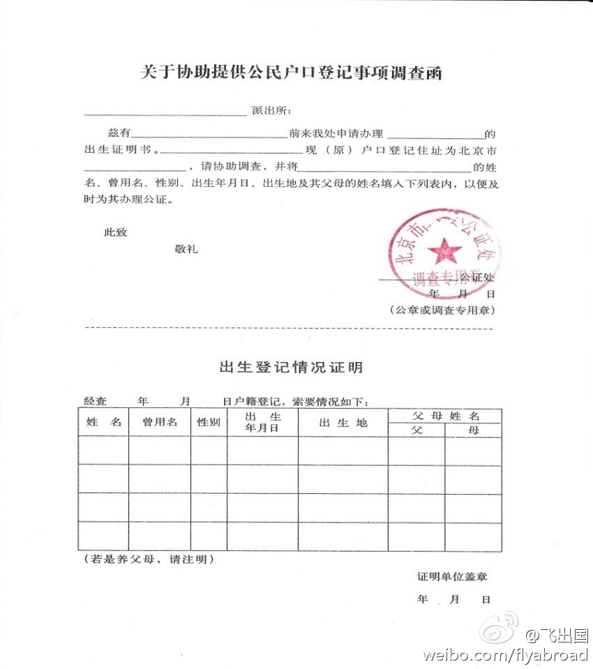

## FLYabroad 出生公证办理指南

普通出生公证办理需要申请人先去户籍地派出所或档案保管地（人才或单位档案室）开具出生证明，有了出生证明才能办理出生公证，出生公证的办理不能跨区域，如果您的出生证明是在北京以外地区开具的，需要您到开具出生证明地区的市一级公证处办理。移民使用的出生公证属于涉外公证，公证词里必须包含英文。出生公证是永久有效的，如果您原先办理过出生公证并且还有副本，那么原先的出生公证依然可以使用。出生公证办理麻烦，因此FLY建议您初次办理出生公证时多做几个备份。

### 出生公证内容及用途概述 - 飞出国

出生公证用于对当事人出生的法律事实给予证明，出生公证内容包括姓名，性别，出生年与日，出生地（县或市），及母亲的姓名。

出生公证上照片是可选的，FLYabroad 一般建议申请人要求公证处在出生公证上贴照片（有些签证要求申请人在出生公证上附上照片）。照片规格可以是35*45mm的，也可以是2寸的，白底，近期彩色照片。

出生公证主要用于办理移民、出国求学、继承财产、办理入籍手续等，另外亲属间的出生公证可以间接证明亲属关系。

### 出生公证办理需要的资料 - FLYabroad

出生公证分为普通出生公证和医学出生证明公证，90后申请人（例如子女）有医院出具的医学出生证明，办理公证很简单。

对于90前出生的申请人可能没有医院的出生医学证明，则需要办理普通出生公证，办理普通出生公证大多数情况下需要开具出生证明，公证词认可的出生证明开具机构包括：派出所户籍科、有人事权的公司（盖人事章）、档案保存的档案室。这些地方大多数有专有的出生证明文本格式，申请人可以向 FLY 索要下面出生登记情况证明表备用。

### 办理费用参考（出生公证） - FLYabroad

普通出生公证费用参考： 公证费用 80元， 公证词翻译 24 元， 共 104元，一个副本20元人民币。

出生医学证明公证费用参考： 公证费用 80元， 公证词翻译 24元，原件翻译费 24元， 共 128元，备份一份20元。

### 公证有效期（出生公证） - FLYabroad

出生公证永久有效，不需要担心公证过期问题。

### 建议办理份数（出生公证） - FLYabroad

出生公证办理复杂，用处广泛，没有有效期，FLYabroad 建议最少做一个备份，如果有其他需要可以多做几个备份。当然，申请人以后可以凭借公证书重新出具副本。

### 办理特殊说明及常见问题（出生公证） - FLYabroad

出生公证是办理相对复杂的公证，对于迁过户口的申请人派出所（无论是出生地还是户籍地）都可能不愿意开具该证明，这种情况下建议申请人去人才档案保管处开具出生证明，有些申请人的档案（人事关系）在单位，这种情况下就需要向单位人事部门咨询。如果不希望单位知道可以先给公证处电话咨询具体处理办法，有些公证处认可街道开具的证明，但有些公证处不认可。

普通出生公证属于直接公证，出生证明用于公证处留档，不退还给申请人。出生公证不能跨区域办理，例如河北开具的出生证明不能在北京公证。

出生公证需要是中英文的（涉外公证），这样才能用于留学，移民等出国事宜。有些县级公证处不具备涉外公证办理资格，就需要到市级公证处办理。

FLYabroad 可以代办绝大部分公证，申请人自己办理公证的请电话或上门咨询具体受理的公证处，具体办理要求以具体公证处要求为准。

## 出生医学证明公证办理指南 - 飞出国

如果有出生医学证明请做医学出生证明的公证，而不是普通出生公证，把医学证明原件拿到公证处即可。通常90后的子女都有医学出生证明。

[相关问题可以到飞出国论坛参与讨论。](https://my.flyabroad.io/?target=_blank)

> 以上内容由`飞出国出入境服务`（[飞出国](flyabroad.io)）独家整理完成，请尊重知识产权，转载请保留并注明出处。（2020-08-25更新）

> 欢迎关注飞出国移民公众号 (微信号fcg-js) 获取更多信息，也可直接联系飞出国工作人员 （微信号flyabroad-nina) 直接进行沟通。